# アーキテクチャ図とシーケンス図

このドキュメントでは、Redis ElastiCache PoCプロジェクトのアーキテクチャとデータフローを視覚的に説明します。

---

## 📐 システムアーキテクチャ

### 全体構成図

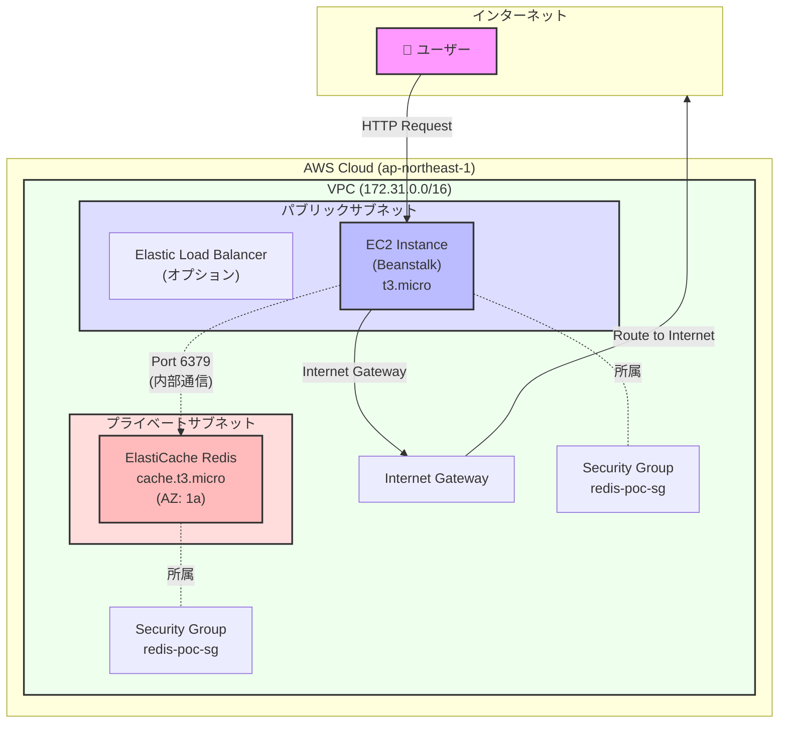

### ネットワーク詳細図

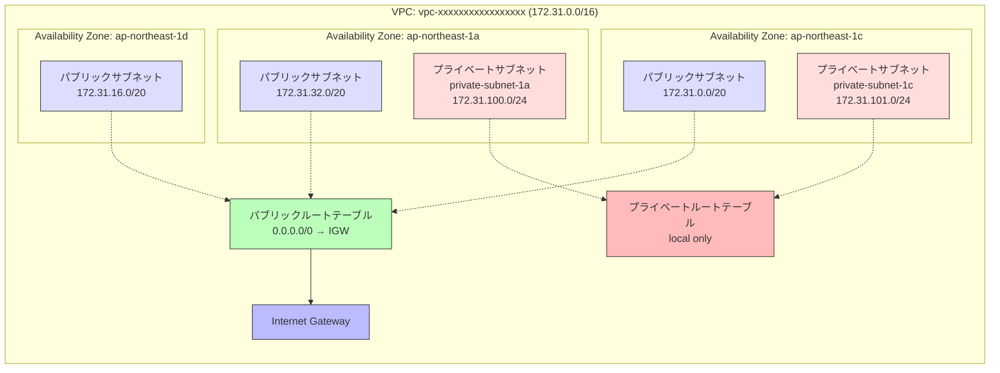

---

## 🔄 データフローとシーケンス図

### 1. ヘルスチェックのシーケンス

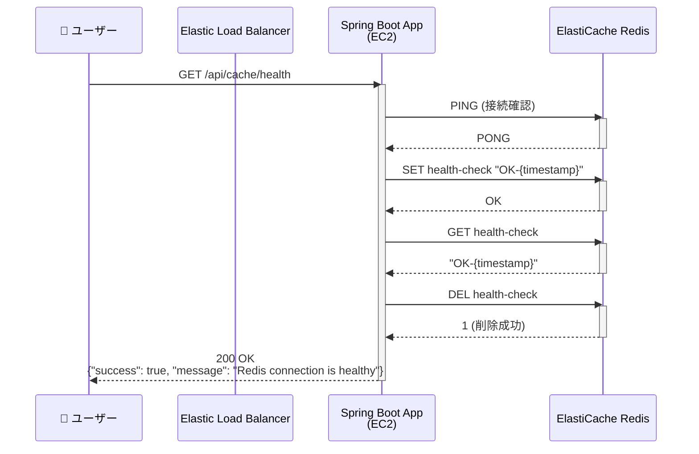

### 2. データ保存（POST）のシーケンス

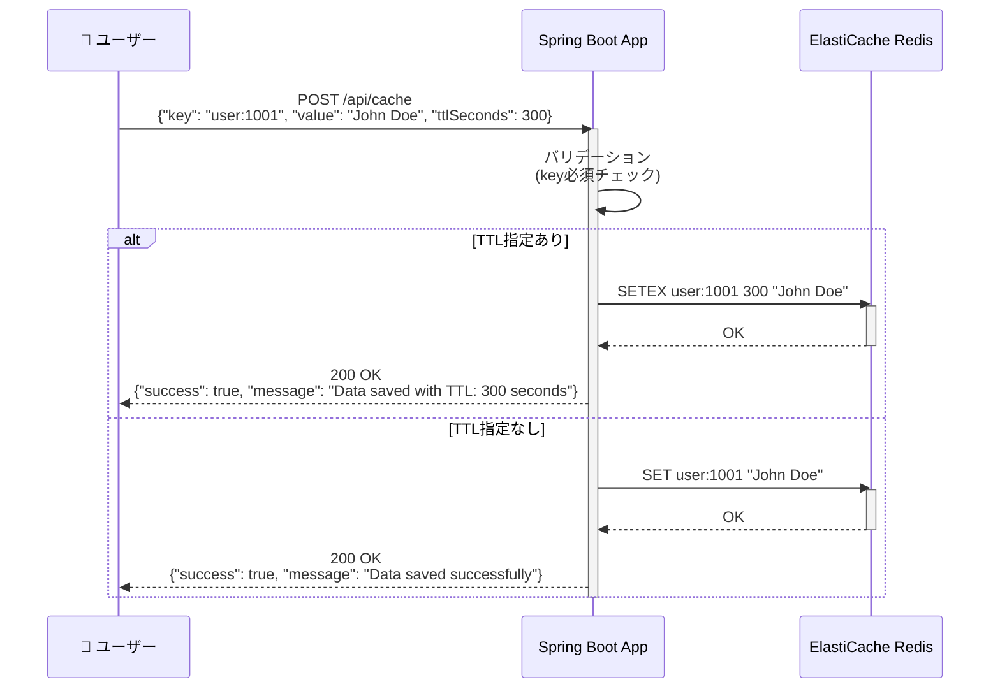

### 3. データ取得（GET）のシーケンス

```mermaid
sequenceDiagram
    participant User as 👤 ユーザー
    participant App as Spring Boot App
    participant Redis as ElastiCache Redis

    User->>App: GET /api/cache/user:1001
    activate App

    App->>Redis: GET user:1001
    activate Redis

    alt データが存在
        Redis-->>App: "John Doe"
        deactivate Redis
        App-->>User: 200 OK<br/>{"success": true, "message": "Data found", "data": "John Doe"}
    else データが存在しない
        Redis-->>App: nil
        deactivate Redis
        App-->>User: 200 OK<br/>{"success": true, "message": "No data found", "data": null}
    end

    deactivate App
```

### 4. TTL確認のシーケンス

```mermaid
sequenceDiagram
    participant User as 👤 ユーザー
    participant App as Spring Boot App
    participant Redis as ElastiCache Redis

    User->>App: GET /api/cache/user:1001/ttl
    activate App

    App->>Redis: TTL user:1001
    activate Redis

    alt TTLが設定されている
        Redis-->>App: 245 (残り秒数)
        deactivate Redis
        App-->>User: 200 OK<br/>{"success": true, "message": "TTL: 245 seconds", "data": 245}
    else TTLが設定されていない
        Redis-->>App: -1
        deactivate Redis
        App-->>User: 200 OK<br/>{"success": true, "message": "No expiration set", "data": -1}
    else キーが存在しない
        Redis-->>App: -2
        deactivate Redis
        App-->>User: 200 OK<br/>{"success": true, "message": "Key does not exist", "data": -2}
    end

    deactivate App
```

### 5. データ削除（DELETE）のシーケンス

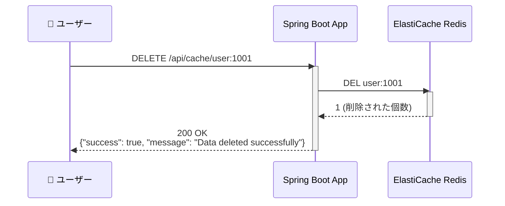

---

## 🏗️ アプリケーション内部構造

### Spring Bootコンポーネント図

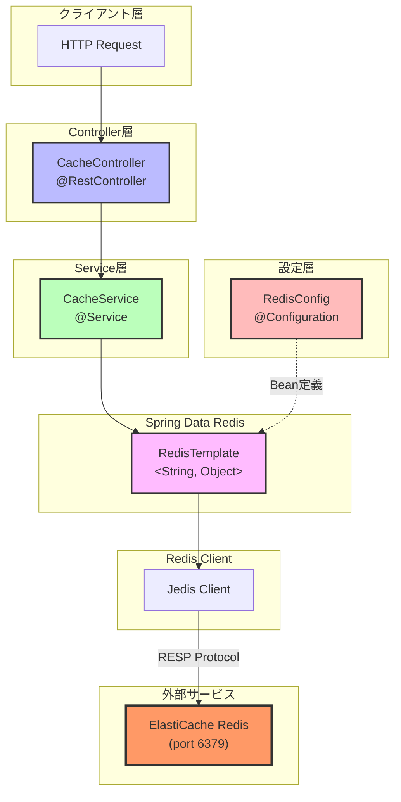

### クラス関連図

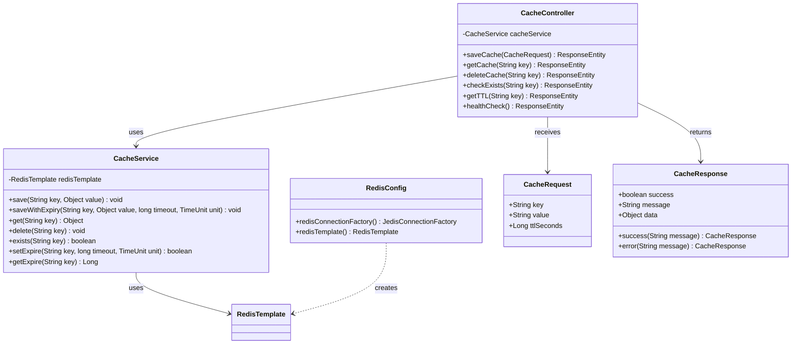

---

## 🔐 セキュリティグループとネットワークACL

### セキュリティグループ構成

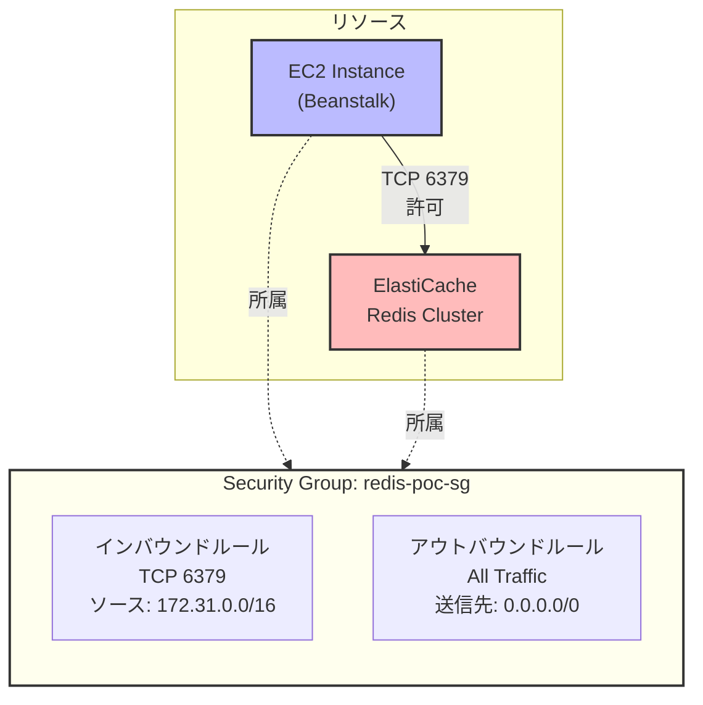

---

## 📊 デプロイメントフロー

### CI/CDパイプライン（手動デプロイ版）

```mermaid
graph LR
    subgraph Development["開発環境"]
        Code["📝 コード編集"]
        Build["🔨 Gradle Build<br/>./gradlew clean bootJar"]
        JAR["📦 application.jar<br/>(31MB)"]
    end

    subgraph AWS_Console["AWS Console"]
        Upload["⬆️ アップロード<br/>Beanstalk Console"]
        Deploy["🚀 デプロイ実行"]
    end

    subgraph Beanstalk["Elastic Beanstalk"]
        Extract["📂 JAR展開"]
        Start["▶️ アプリ起動<br/>Port 5000"]
        Health["✅ ヘルスチェック"]
    end

    subgraph Production["本番環境"]
        Running["🌐 稼働中<br/>your-app-env.elasticbeanstalk.com"]
    end

    Code --> Build
    Build --> JAR
    JAR --> Upload
    Upload --> Deploy
    Deploy --> Extract
    Extract --> Start
    Start --> Health
    Health -->|"成功"| Running
    Health -->|"失敗"| Start

    style Code fill:#bfb,stroke:#333
    style Build fill:#bbf,stroke:#333
    style JAR fill:#fbf,stroke:#333
    style Running fill:#f96,stroke:#333,stroke-width:3px
```

---

## 🎯 リクエストフロー全体像

### エンドツーエンドのデータフロー

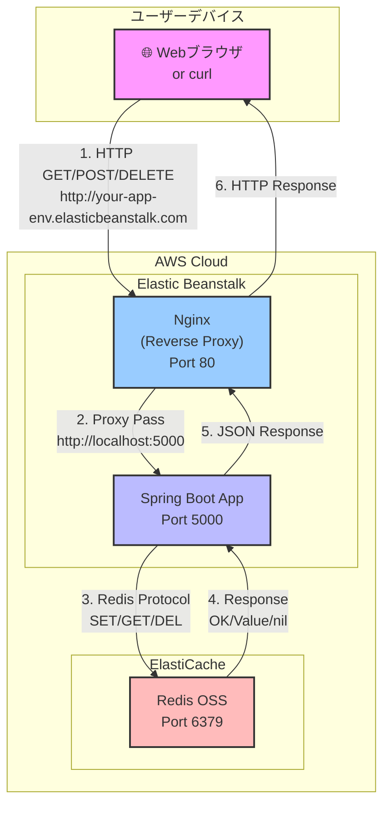

---

## 📈 スケーラビリティ構成（将来の拡張）

### オートスケーリング構成（参考）

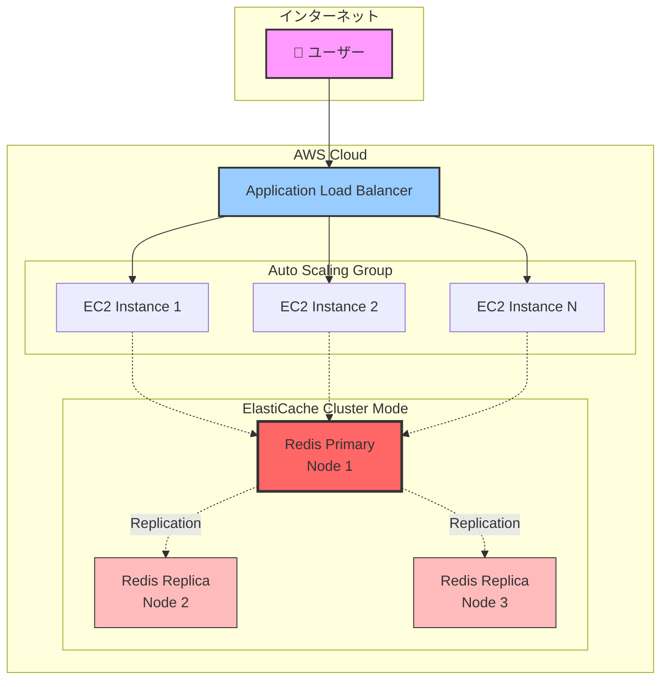

---

## 🔄 エラーハンドリングフロー

### 接続エラー時の処理

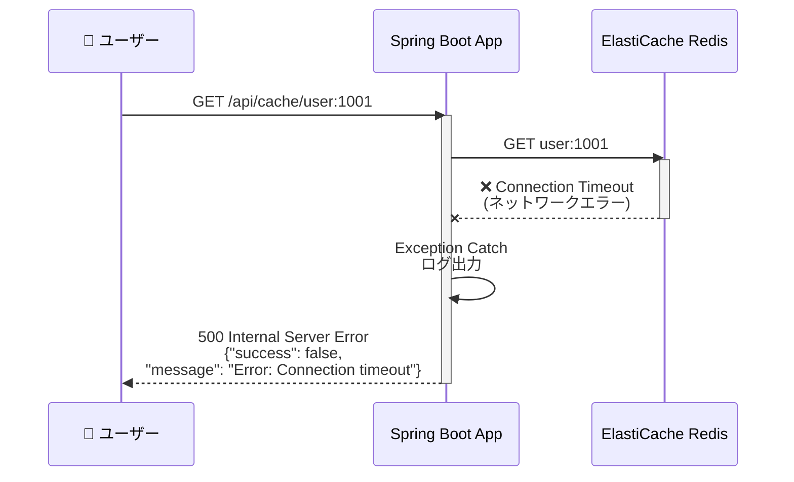

---

## 📝 まとめ

このドキュメントでは、以下の図を使ってシステムを説明しました：

1. **システムアーキテクチャ**: AWS全体の構成
2. **ネットワーク詳細図**: VPC、サブネット、ルートテーブルの関係
3. **シーケンス図**: 各API操作のデータフロー
4. **コンポーネント図**: Spring Bootアプリケーションの内部構造
5. **クラス関連図**: Javaクラスの依存関係
6. **セキュリティグループ**: ネットワークアクセス制御
7. **デプロイメントフロー**: ビルドからデプロイまでの流れ
8. **リクエストフロー**: エンドツーエンドの全体像
9. **スケーラビリティ構成**: 将来の拡張案
10. **エラーハンドリング**: エラー時の処理フロー

これらの図を参考に、システムの理解を深めてください。
