# ElastiCache 構成ガイド

ElastiCacheを作成する際の構成パターン、必須項目、選択肢を図解で説明します。

---

## 📋 目次

1. [作成時の必須項目](#作成時の必須項目)
2. [クラスター構成パターン](#クラスター構成パターン)
3. [ノードタイプの選び方](#ノードタイプの選び方)
4. [ネットワーク設定](#ネットワーク設定)
5. [セキュリティ設定](#セキュリティ設定)
6. [バックアップと可用性](#バックアップと可用性)
7. [コスト比較](#コスト比較)
8. [用途別推奨構成](#用途別推奨構成)

---

## 作成時の必須項目

### 必須項目チェックリスト

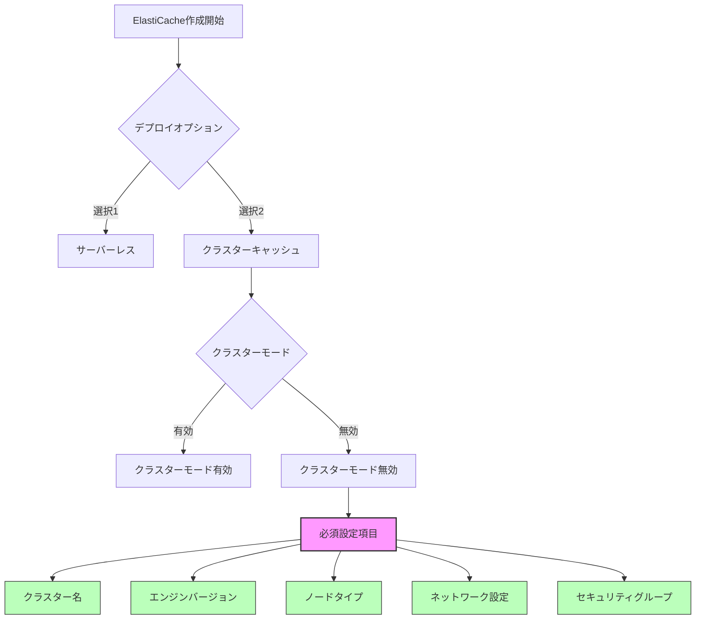

### 必須項目の詳細

| 項目 | 必須/任意 | 説明 | 例 |
|------|----------|------|-----|
| **クラスター名** | ✅ 必須 | 一意の識別名 | `redis-poc-cluster` |
| **エンジンバージョン** | ✅ 必須 | Redis OSS バージョン | `7.1` |
| **ノードタイプ** | ✅ 必須 | インスタンスサイズ | `cache.t3.micro` |
| **レプリカ数** | ⚪ 任意 | 0〜5個 | `0`（PoC）、`1`（本番） |
| **サブネットグループ** | ✅ 必須 | VPC配置先 | `redis-poc-subnet-group` |
| **セキュリティグループ** | ✅ 必須 | アクセス制御 | `redis-poc-sg` |
| **ポート** | ⚪ 任意 | デフォルト6379 | `6379` |
| **暗号化** | ⚪ 任意 | at-rest/in-transit | 無効（PoC）、有効（本番） |
| **バックアップ** | ⚪ 任意 | 自動バックアップ | 無効（PoC）、有効（本番） |

---

## クラスター構成パターン

### パターン1: 単一ノード（最小構成）

**用途:** PoC、開発環境、キャッシュのみ

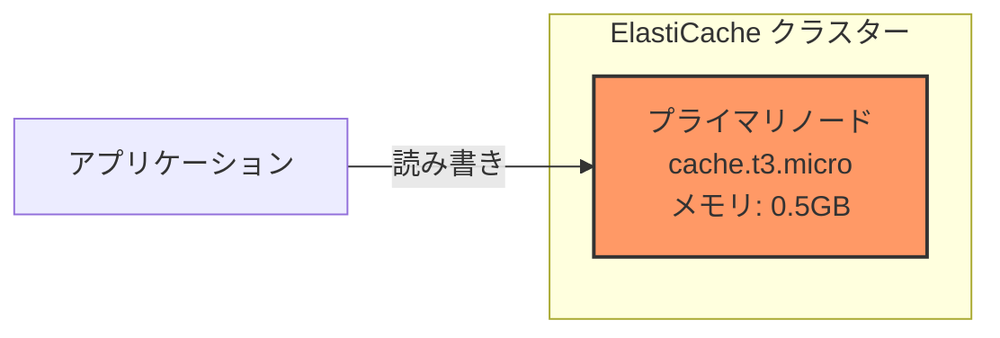

**特徴:**
- ✅ 最も安い（約4円/時間）
- ✅ シンプル
- ❌ 障害時にダウン
- ❌ バックアップなし

**設定:**
```yaml
ノードタイプ: cache.t3.micro
レプリカ数: 0
マルチAZ: 無効
```

---

### パターン2: レプリカ付き（高可用性）

**用途:** 本番環境、高可用性が必要

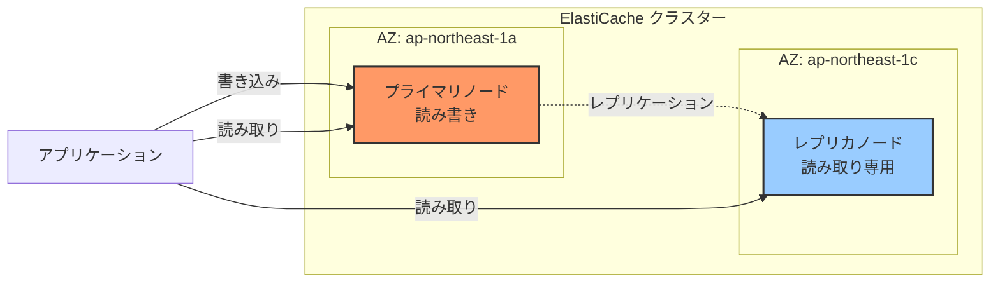

**特徴:**
- ✅ 高可用性（プライマリ障害時にレプリカが昇格）
- ✅ 読み取り性能向上（負荷分散）
- ✅ マルチAZ対応
- ❌ コスト2倍

**設定:**
```yaml
ノードタイプ: cache.t3.micro
レプリカ数: 1
マルチAZ: 有効
自動フェイルオーバー: 有効
```

**動作:**
1. 通常時：プライマリで書き込み、レプリカで読み取り
2. 障害時：レプリカが自動的にプライマリに昇格

---

### パターン3: クラスターモード（スケーラブル）

**用途:** 大規模データ、高スループット

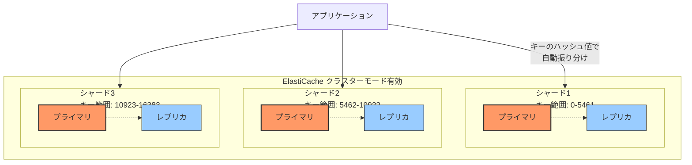

**特徴:**
- ✅ 大量データ対応（データ分散）
- ✅ 高スループット
- ✅ 水平スケーリング可能
- ❌ 複雑な設定
- ❌ コスト高（シャード数 × ノード数）

**設定:**
```yaml
クラスターモード: 有効
シャード数: 3
レプリカ/シャード: 1
ノードタイプ: cache.r6g.large
```

**データ分散の仕組み:**
```
キー "user:1001" → ハッシュ値 3456 → シャード1
キー "user:2002" → ハッシュ値 8901 → シャード2
キー "user:3003" → ハッシュ値 15000 → シャード3
```

---

## ノードタイプの選び方

### ノードタイプ一覧

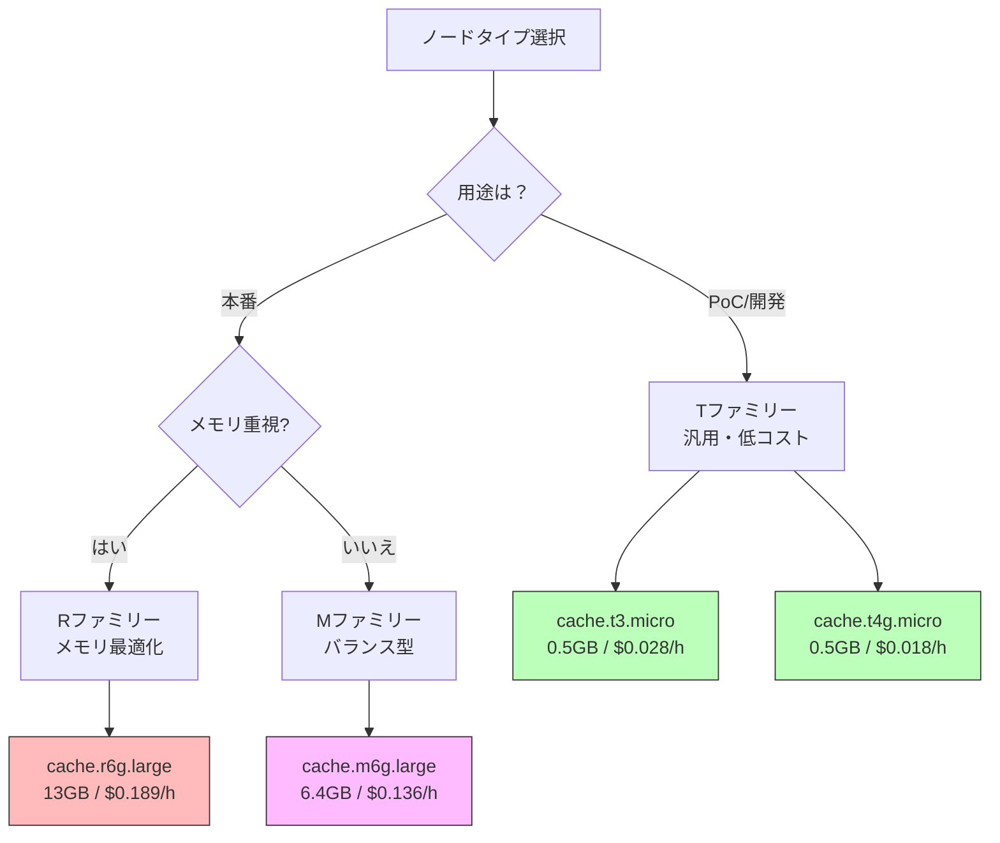

### ファミリー別比較

| ファミリー | 特徴 | 用途 | 例 |
|-----------|------|------|-----|
| **T（汎用）** | 低コスト、バースト可能 | PoC、開発、小規模 | `cache.t3.micro` |
| **T4g（汎用 Graviton2）** | T3より20%安い | PoC、開発、コスト重視 | `cache.t4g.micro` |
| **M（バランス）** | CPU/メモリバランス | 中規模本番 | `cache.m6g.large` |
| **R（メモリ最適化）** | 大容量メモリ | 大規模データ | `cache.r6g.large` |

### サイズ別比較（Tファミリー）

| ノードタイプ | メモリ | vCPU | 料金/時間 | 料金/月 | 用途 |
|-------------|-------|------|----------|---------|------|
| **cache.t3.micro** | 0.5 GB | 2 | $0.028 | 約3,000円 | PoC |
| **cache.t3.small** | 1.37 GB | 2 | $0.055 | 約6,000円 | 小規模 |
| **cache.t3.medium** | 3.09 GB | 2 | $0.111 | 約12,000円 | 中規模 |

### 選び方フローチャート

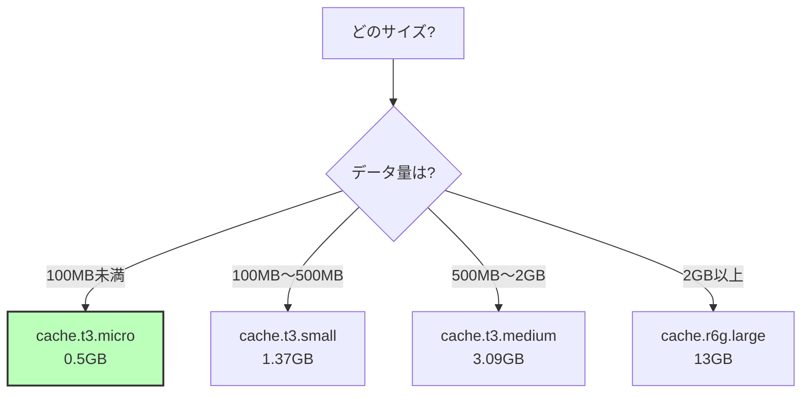

---

## ネットワーク設定

### VPCとサブネット構成

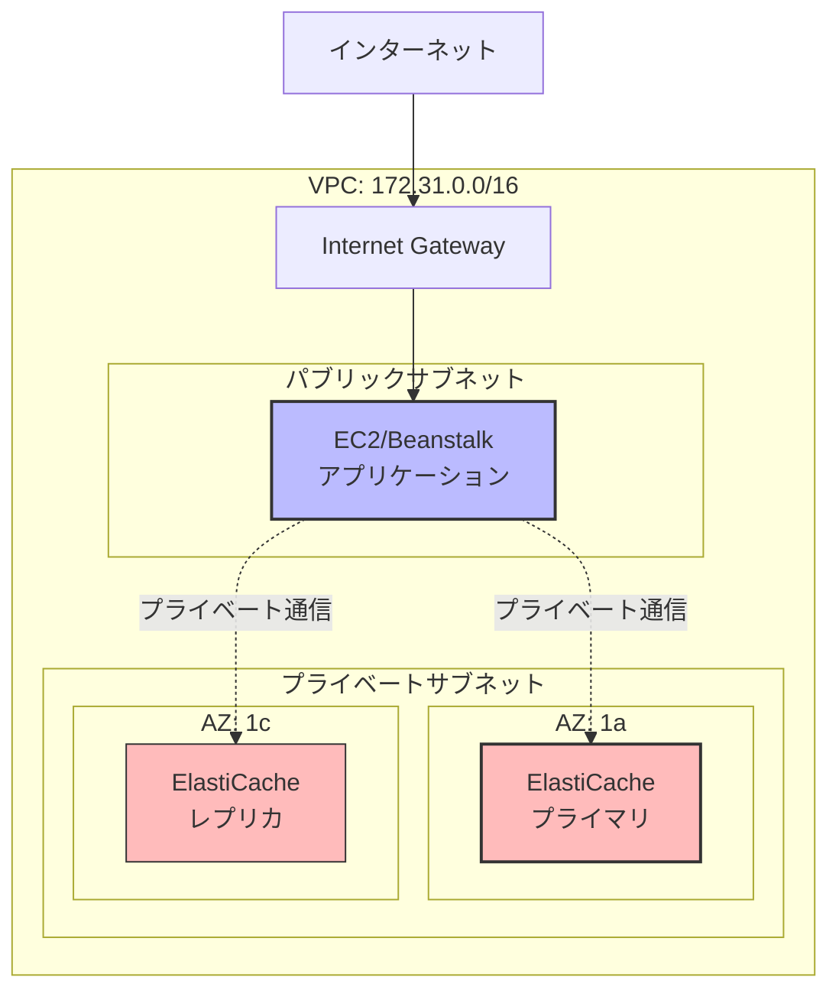

### 必須ネットワーク設定

#### 1. サブネットグループ

**必須:** 最低2つのAZにサブネットが必要

```yaml
サブネットグループ名: redis-poc-subnet-group
VPC: vpc-xxxxxxxxxxxxxxxxx
サブネット:
  - private-subnet-1a (AZ: ap-northeast-1a)
  - private-subnet-1c (AZ: ap-northeast-1c)
```

**理由:** マルチAZ対応のため

#### 2. セキュリティグループ

**必須:** ポート6379の通信許可

```yaml
セキュリティグループ名: redis-poc-sg
インバウンドルール:
  - タイプ: カスタムTCP
  - ポート: 6379
  - ソース: 172.31.0.0/16（VPC CIDR）または アプリのSG
  - 説明: Allow from VPC
```

---

## セキュリティ設定

### セキュリティオプション

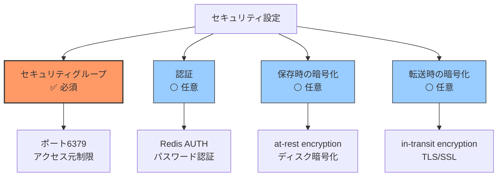

### 推奨設定

| 設定 | PoC | 本番 | 説明 |
|------|-----|------|------|
| **セキュリティグループ** | ✅ 有効 | ✅ 有効 | 必須 |
| **認証（AUTH）** | ❌ 無効 | ✅ 有効 | パスワード認証 |
| **保存時の暗号化** | ❌ 無効 | ✅ 有効 | データ暗号化 |
| **転送時の暗号化** | ❌ 無効 | ✅ 有効 | TLS通信 |

---

## バックアップと可用性

### バックアップオプション

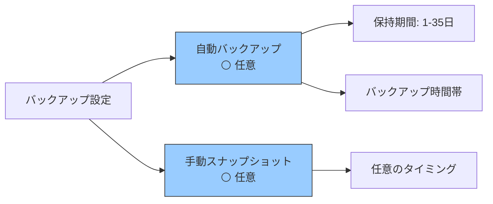

### 設定比較

| 項目 | PoC | 本番 |
|------|-----|------|
| **自動バックアップ** | ❌ 無効 | ✅ 有効 |
| **保持期間** | - | 7日 |
| **バックアップウィンドウ** | - | 深夜3-4時 |
| **マルチAZ** | ❌ 無効 | ✅ 有効 |
| **自動フェイルオーバー** | ❌ 無効 | ✅ 有効 |

---

## コスト比較

### 構成別の月額コスト（概算）

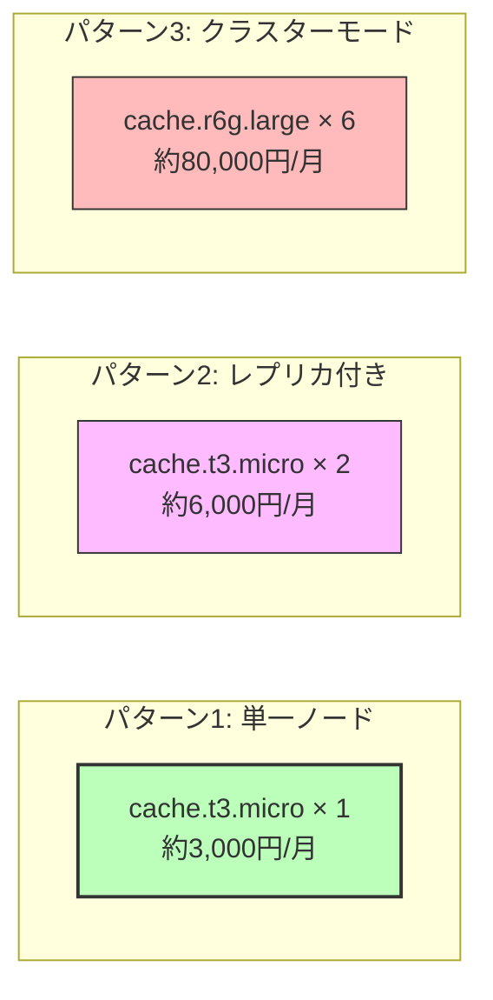

### 詳細コスト表

| 構成 | ノード数 | ノードタイプ | 時間単価 | 月額 |
|------|----------|-------------|----------|------|
| **最小構成** | 1 | cache.t3.micro | $0.028 | 約3,000円 |
| **PoC + レプリカ** | 2 | cache.t3.micro | $0.056 | 約6,000円 |
| **本番・小規模** | 2 | cache.m6g.large | $0.272 | 約29,000円 |
| **本番・大規模** | 6 | cache.r6g.large | $1.134 | 約122,000円 |

**注意:**
- 上記はインスタンス料金のみ
- データ転送料、バックアップ保存料は別途

---

## 用途別推奨構成

### 1. PoC・検証用（本プロジェクト）

```yaml
デプロイオプション: クラスターキャッシュ
クラスターモード: 無効
ノードタイプ: cache.t3.micro
レプリカ数: 0
マルチAZ: 無効
暗号化: 無効
バックアップ: 無効
コスト: 約3,000円/月
```

**特徴:**
- ✅ 最小コスト
- ✅ シンプル
- ❌ 本番不可

---

### 2. 開発環境

```yaml
デプロイオプション: クラスターキャッシュ
クラスターモード: 無効
ノードタイプ: cache.t3.small
レプリカ数: 0
マルチAZ: 無効
暗号化: 無効
バックアップ: 有効（保持1日）
コスト: 約6,000円/月
```

**特徴:**
- ✅ 低コスト
- ✅ バックアップあり
- ⚪ 可用性は低い

---

### 3. 本番環境・小規模

```yaml
デプロイオプション: クラスターキャッシュ
クラスターモード: 無効
ノードタイプ: cache.m6g.large
レプリカ数: 1
マルチAZ: 有効
自動フェイルオーバー: 有効
暗号化（at-rest）: 有効
暗号化（in-transit）: 有効
認証: 有効
バックアップ: 有効（保持7日）
コスト: 約29,000円/月
```

**特徴:**
- ✅ 高可用性
- ✅ セキュア
- ✅ 自動フェイルオーバー

---

### 4. 本番環境・大規模

```yaml
デプロイオプション: クラスターキャッシュ
クラスターモード: 有効
シャード数: 3
レプリカ/シャード: 1
ノードタイプ: cache.r6g.large
マルチAZ: 有効
暗号化（at-rest）: 有効
暗号化（in-transit）: 有効
認証: 有効
バックアップ: 有効（保持14日）
コスト: 約122,000円/月
```

**特徴:**
- ✅ 超高可用性
- ✅ スケーラブル
- ✅ 大量データ対応
- ❌ 高コスト

---

## 作成フロー全体図

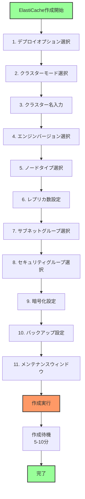

---

## まとめ

### 用途別の推奨構成

| 用途 | 推奨パターン | コスト |
|------|-------------|--------|
| **学習・PoC** | パターン1（単一ノード） | 約3,000円/月 |
| **開発環境** | パターン1 + バックアップ | 約6,000円/月 |
| **本番環境** | パターン2（レプリカ付き） | 約29,000円/月〜 |

### チェックリスト

作成前に確認：

- [ ] 用途を明確にする（PoC/開発/本番）
- [ ] 予算を決める
- [ ] VPCとサブネットを準備
- [ ] セキュリティグループを作成
- [ ] ノードタイプを選択
- [ ] レプリカの要否を判断
- [ ] バックアップの要否を判断

---

**作成日:** 2025年10月4日
**関連ドキュメント:** [ELASTICACHE_SETUP.md](ELASTICACHE_SETUP.md)
